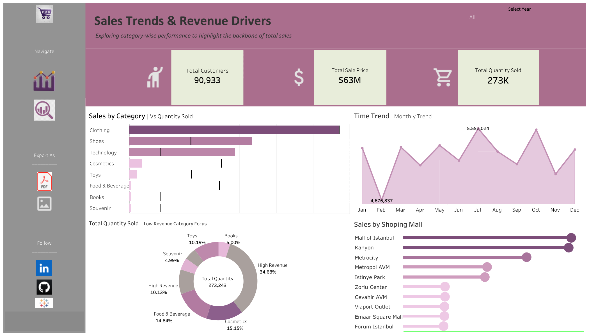

# Sales Analysis Dashboard (Tableau)

## Project Overview
This project focuses on analyzing sales data to identify revenue trends, high-performing categories, and areas with low sales contribution.  
The analysis was performed using Tableau, and the final output is an interactive dashboard published on Tableau Public.

## Tools & Technologies
- Tableau Public
- SQL (for data preparation)
- Kaggle Dataset

## Key Skills Demonstrated
- Data cleaning and preparation
- Sales trend analysis
- Category-wise revenue analysis
- Data visualization and dashboard design
- Business insights and storytelling

## Tableau Dashboard

View the interactive dashboard here: [Sales Analysis Dashboard](https://public.tableau.com/app/profile/maria.aslam/viz/Sales_17681494125720/SalesInsight)

### Dashboard Screenshots

## SQL Analysis

The SQL file included in this repository contains queries used for:
- Data cleaning and preprocessing
- Category-wise sales aggregation
- Revenue calculations used in Tableau dashboards

File: 

